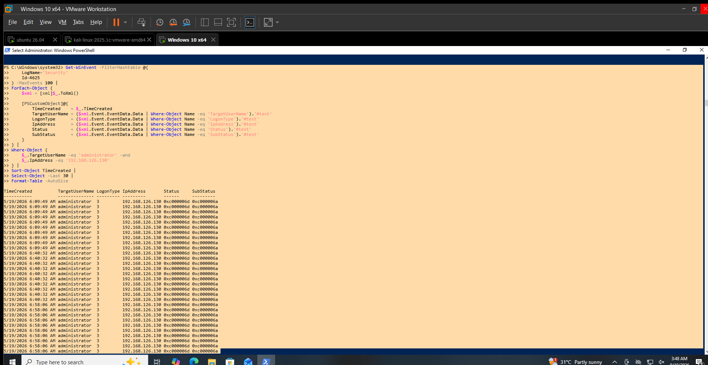

# Failed Logon Detection

## Objective

Detect repeated failed network authentication attempts against a Windows account.

## Data Source

Windows Security Event Log

## Event ID

`4625` — An account failed to log on.

## Detection Logic

Identify repeated Event ID `4625` events and review:

- Target account
- Source IP address
- Logon type
- Time of occurrence
- Failure status

Repeated failures from the same source against the same account may indicate password guessing or other authentication-related activity.

## Test Activity

Existing Windows Security telemetry was queried for repeated failed logon events.

The investigation focused on failed authentication attempts against the `administrator` account from source `192.168.126.130`.

## Observed Result

30 Event ID `4625` records were identified for:

- Target account: `administrator`
- Source IP: `192.168.126.130`
- Logon Type: `3`
- Status: `0xc000006d`
- SubStatus: `0xc000006a`

The events appeared in three groups of 10 records at:

- `06:09:49`
- `06:40:32`
- `06:58:06`

The source address was on the `192.168.126.0/24` network used by the second network interface of `WIN-SOC01`.

The source host could not be identified from the current ARP or neighbor cache, and the address was not reachable during validation.

## Analyst Interpretation

The telemetry shows repeated failed network authentication attempts against the `administrator` account.

The observed pattern is consistent with repeated authentication failures, but the available evidence does not establish that the activity was a confirmed brute-force attack.

The source system could not be identified during the validation.

## MITRE ATT&CK Mapping

- **T1110 — Brute Force**

The detection is relevant to brute-force investigation, but the observed activity is not classified as confirmed brute-force behavior.

## Limitations

- The source host `192.168.126.130` could not be identified.
- The source was not reachable during validation.
- The available events alone do not establish attacker intent.
- No remote attack tool was attributed to these events.

## Validation Status

**VALIDATED LOCALLY**

Event ID `4625` was successfully queried and reviewed on `WIN-SOC01`.

## Evidence

