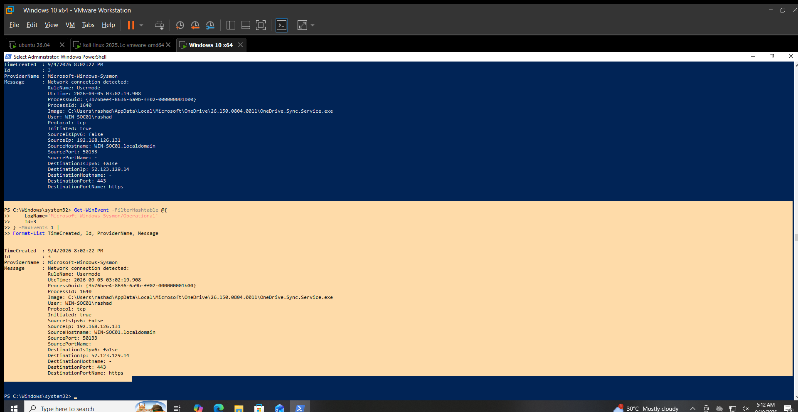

# Network Activity Detection

## Objective

Detect network connection activity recorded by Sysmon and provide network context for analyst review.

## Data Source

Sysmon Operational Log

## Event ID

`3` — Network connection detected.

## Detection Logic

Identify Sysmon Event ID `3` events and review:

- Process image
- User
- Protocol
- Source IP and port
- Destination IP and port
- Connection direction
- Destination service

Network connections from unexpected processes, unusual destinations, or unexpected ports should receive additional analyst review.

A network connection alone is not considered malicious.

## Test Activity

An existing Sysmon Event ID `3` record was reviewed on `WIN-SOC01`.

The event recorded an outbound TCP connection generated by the OneDrive synchronization service.

## Observed Result

The following network connection was observed:

- Event ID: `3`
- Time: `9/4/2026 8:02:22 PM`
- Process: `C:\Users\rashad\AppData\Local\Microsoft\OneDrive\26.150.0804.0011\OneDrive.Sync.Service.exe`
- User: `WIN-SOC01\rashad`
- Protocol: `tcp`
- Initiated: `true`
- Source IP: `192.168.126.131`
- Source Port: `50133`
- Destination IP: `52.123.129.14`
- Destination Port: `443`
- Destination Service: `https`

## Analyst Interpretation

Sysmon successfully recorded the network connection and provided process, user, source, destination and port information.

The observed connection was generated by the OneDrive synchronization service over HTTPS.

The event demonstrates that Sysmon network telemetry can provide useful context for network activity investigation.

## MITRE ATT&CK Mapping

Network connection telemetry can support investigation of several techniques depending on the process and destination involved.

No specific malicious technique is assigned to this observed event because the recorded activity was associated with OneDrive HTTPS traffic.

## Limitations

- Network connection telemetry alone does not establish malicious activity.
- The observed connection was legitimate application traffic.
- Destination IP reputation and additional network context were not evaluated as part of this validation.

## Validation Status

**VALIDATED LOCALLY**

Sysmon Event ID `3` was successfully queried and reviewed on `WIN-SOC01`.

## Evidence

