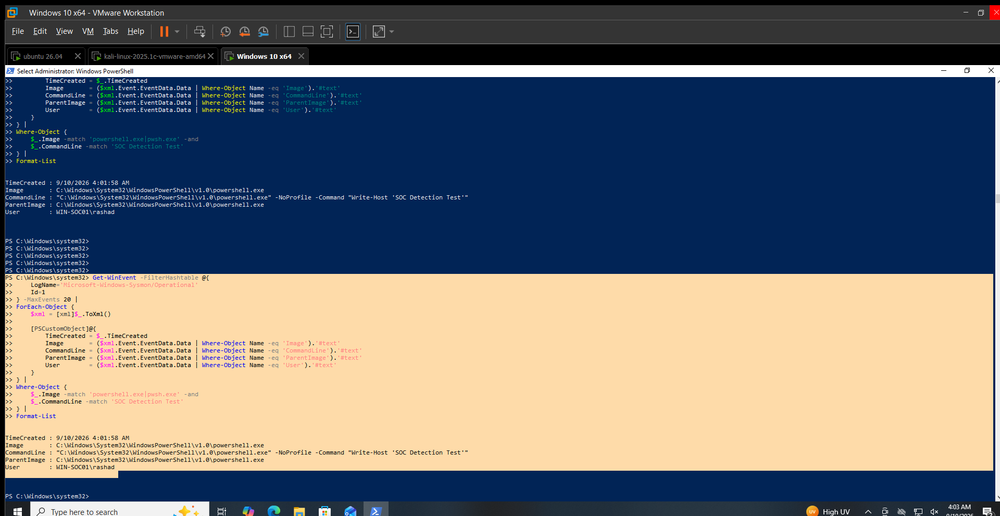

# Suspicious PowerShell Detection

## Objective

Detect PowerShell process execution and provide command-line information for analyst review.

## Data Source

Sysmon Operational Log

## Event ID

`1` — Process Creation

## Detection Logic

Identify process creation events where the process image is:

- `powershell.exe`
- `pwsh.exe`

Review the command line, parent process, user and execution context for suspicious characteristics.

PowerShell execution alone is not considered malicious.

## Test Activity

A benign PowerShell command was executed on `WIN-SOC01`:

```powershell
powershell.exe -NoProfile -Command "Write-Host 'SOC Detection Test'"
```
## Observed Result

Sysmon recorded the PowerShell execution as Event ID 1.

Observed fields:

Process: C:\Windows\System32\WindowsPowerShell\v1.0\powershell.exe
Command Line: "C:\Windows\System32\WindowsPowerShell\v1.0\powershell.exe" -NoProfile -Command "Write-Host 'SOC Detection Test'"
Parent Process: C:\Windows\System32\WindowsPowerShell\v1.0\powershell.exe
User: WIN-SOC01\rashad
Time: 9/10/2026 4:01:58 AM

## Analyst Interpretation

PowerShell execution was successfully captured by Sysmon.

The test command was benign and was generated specifically to validate process telemetry.

The event demonstrates that the process image, command line, parent process and user context are available for detection and investigation.

## MITRE ATT&CK Mapping

T1059.001 — Command and Scripting Interpreter: PowerShell

## Limitations

-PowerShell execution alone does not indicate malicious activity.
-Additional command-line and process-context analysis is required to determine whether an execution is suspicious.
-The validation used a benign test command.

## Validation Status

**VALIDATED LOCALLY**

Sysmon Event ID 1 successfully captured the controlled PowerShell execution on WIN-SOC01.

## Evidence

