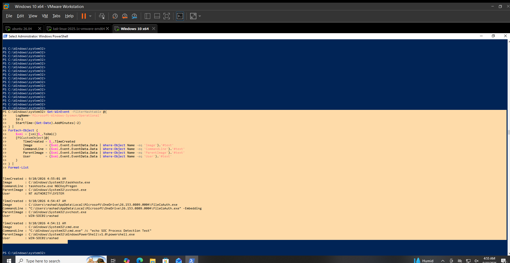

# Suspicious Process Execution Detection

## Objective

Detect process creation activity and provide process and execution context for analyst review.

## Data Source

Sysmon Operational Log

## Event ID

`1` — Process Creation

## Detection Logic

Identify Sysmon Event ID `1` events and review:

- Process image
- Command line
- Parent process
- User
- Time of execution

Processes running from unusual locations, unexpected parent-child relationships, or suspicious command lines should receive additional analyst review.

Process creation alone is not considered malicious.

## Test Activity

A benign process creation test was executed on `WIN-SOC01`:

```powershell
cmd.exe /c "echo SOC Process Detection Test"
```

## Observed Result

Sysmon recorded the process execution as Event ID 1.

Observed fields:

Process: C:\Windows\System32\cmd.exe
Command Line: "C:\Windows\system32\cmd.exe" /c "echo SOC Process Detection Test"
Parent Process: C:\Windows\System32\WindowsPowerShell\v1.0\powershell.exe
User: WIN-SOC01\rashad
Time: 9/10/2026 4:54:11 AM

## Analyst Interpretation

Sysmon successfully captured the controlled process creation activity.

The test command was benign and was executed specifically to validate process telemetry.

The event provides process, command-line, parent-process and user information that can be used during SOC investigation.

## MITRE ATT&CK Mapping

T1059.003 — Command and Scripting Interpreter: Windows Command Shell

## Limitations

Process creation alone does not indicate malicious activity.
Additional process context and command-line analysis are required.
The validation used a benign test command.

## Validation Status

**VALIDATED LOCALLY**

Sysmon Event ID 1 successfully captured the controlled cmd.exe process execution on WIN-SOC01.

## Evidence


