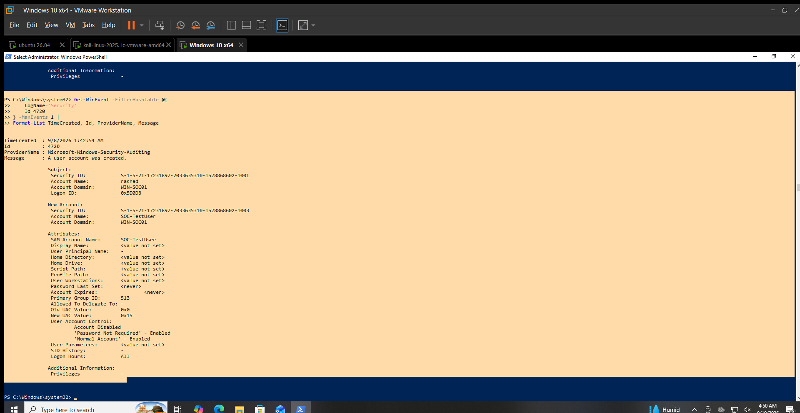

# User Account Creation Detection

## Objective

Detect the creation of new Windows user accounts.

## Data Source

Windows Security Event Log

## Event ID

`4720` — A user account was created.

## Detection Logic

Identify Event ID `4720` events and review:

- Account that created the user
- New account name
- Account domain
- Account state
- User Account Control attributes
- Time of creation

New or unexpected account creation should be reviewed by the SOC analyst.

## Test Activity

An existing Event ID `4720` record was reviewed on `WIN-SOC01`.

The event recorded the creation of the `SOC-TestUser` account by the `rashad` account.

## Observed Result

The following event was observed:

- Event ID: `4720`
- Time: `9/8/2026 1:42:54 AM`
- Created by: `rashad`
- New account: `SOC-TestUser`
- Account domain: `WIN-SOC01`
- Account status: Disabled
- Password Not Required: Enabled
- Normal Account: Enabled

## Analyst Interpretation

The Windows Security log successfully recorded the creation of a new local user account.

The account was disabled and had the Password Not Required attribute enabled at the time of the event.

The event provides useful account-creation context for SOC investigation.

## MITRE ATT&CK Mapping

- **T1136.001 — Create Account: Local Account**

## Limitations

- Event ID `4720` confirms that an account was created but does not by itself establish malicious intent.
- The analyst should review the account creator and surrounding activity.
- The observed account was part of the laboratory validation.

## Validation Status

**VALIDATED LOCALLY**

Event ID `4720` was successfully queried and reviewed on `WIN-SOC01`.

## Evidence

