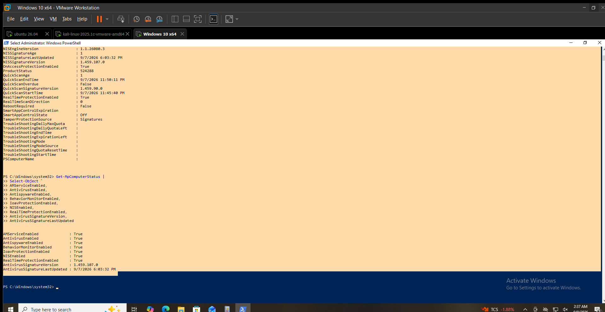
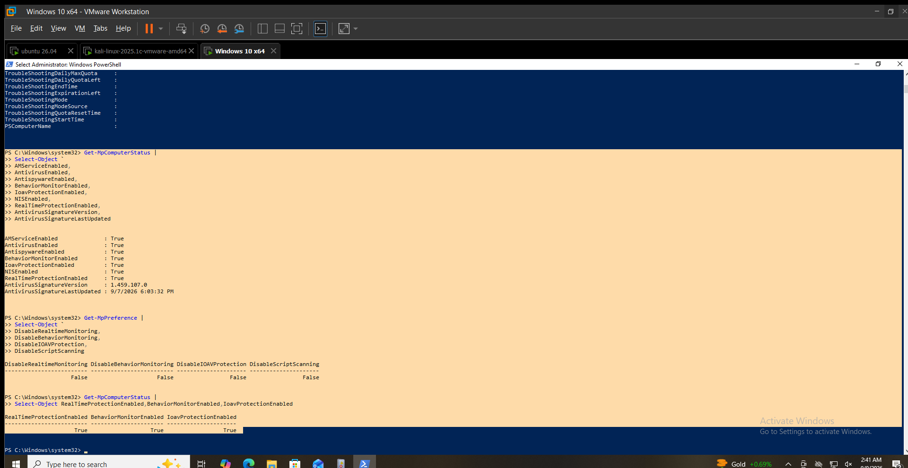
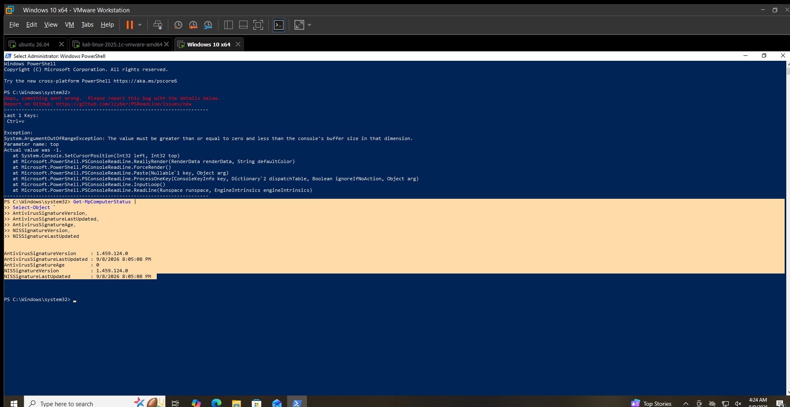
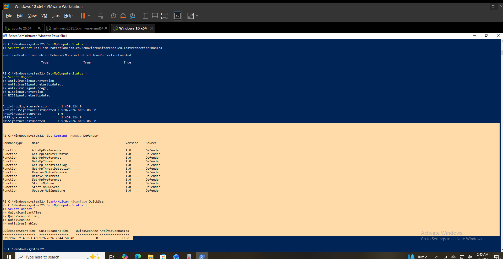
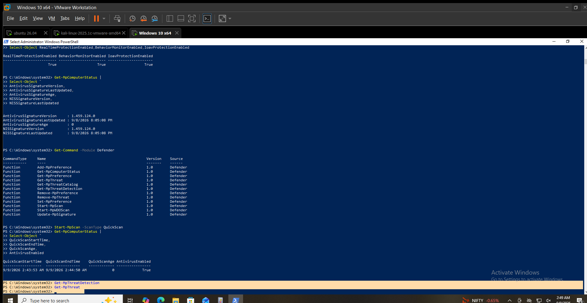
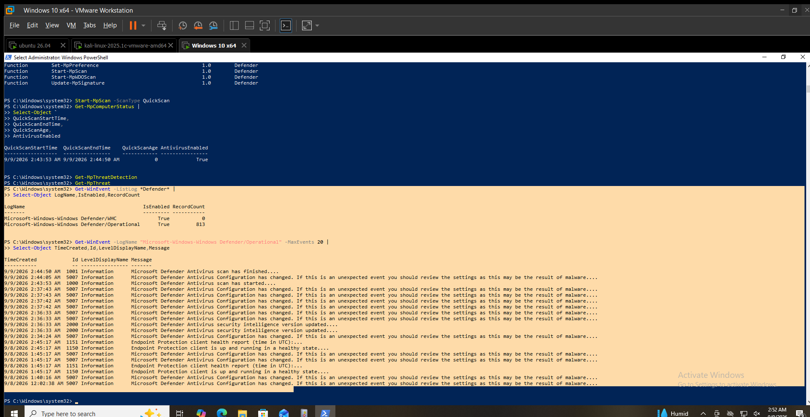

# Microsoft Defender

## Objective

Validate the Microsoft Defender Antivirus configuration, protection state, security intelligence state, scanning capability, threat history, and local operational telemetry on `WIN-SOC01`.

## Endpoint

`WIN-SOC01`

- Operating System: Windows 10 Pro
- Virtual Machine: Yes

## Defender Configuration

Microsoft Defender Antivirus is enabled and running normally on `WIN-SOC01`.

The following Defender components were reported as enabled:

| Component | Status |
|---|---|
| AM Service | Enabled |
| Antivirus | Enabled |
| Antispyware | Enabled |
| Behavior Monitoring | Enabled |
| IOAV Protection | Enabled |
| Network Inspection System (NIS) | Enabled |
| Real-Time Protection | Enabled |
| On-Access Protection | Enabled |
| Tamper Protection | Enabled |

`Get-MpComputerStatus` reported:

```text
AMRunningMode             : Normal
AMServiceEnabled          : True
AntivirusEnabled          : True
AntispywareEnabled        : True
BehaviorMonitorEnabled    : True
IoavProtectionEnabled     : True
NISEnabled                : True
RealTimeProtectionEnabled : True
OnAccessProtectionEnabled : True
IsTamperProtected         : True


## Real-Time Protection

The Defender configuration and current protection state were compared.

Configuration:

DisableRealtimeMonitoring : False
DisableBehaviorMonitoring : False
DisableIOAVProtection     : False
DisableScriptScanning     : False

Current protection state:

RealTimeProtectionEnabled : True
BehaviorMonitorEnabled    : True
IoavProtectionEnabled     : True

The configuration and runtime status are consistent.

Real-time protection, behavior monitoring, and IOAV protection are enabled on WIN-SOC01.

## Signature / Security Intelligence State

The Defender security intelligence state was checked using Get-MpComputerStatus.

AntivirusSignatureVersion     : 1.459.124.0
AntivirusSignatureLastUpdated : 9/8/2026 8:05:08 PM
AntivirusSignatureAge         : 0
NISSignatureVersion           : 1.459.124.0
NISSignatureLastUpdated       : 9/8/2026 8:05:08 PM

The antivirus and NIS security intelligence were updated on September 8, 2026, with a reported signature age of 0 days at the time of validation.

## Scan Validation

The Defender PowerShell module was verified and included the Start-MpScan cmdlet.

A Quick Scan was then started using:

```powershell
Start-MpScan -ScanType QuickScan
```
The resulting status was:

QuickScanStartTime  : 9/9/2026 2:43:53 AM
QuickScanEndTime    : 9/9/2026 2:44:50 AM
QuickScanAge        : 0
AntivirusEnabled    : True

The scan completed successfully according to the populated start and end times.

The scan duration was approximately 57 seconds.

The output confirms scan activity and completion. No claim about the number of detected threats is made from this status output.

## Threat History

The following commands were checked:

```powershell
Get-MpThreatDetection
Get-MpThreat
```
Both commands returned no records.

Therefore:

No Defender threats were observed during the Day 3 validation window.

No malware was introduced into the laboratory to artificially generate a detection.

## Operational Logs

Available Defender event logs were checked using:

```powershell
Get-WinEvent -ListLog *Defender* |
Select-Object LogName,IsEnabled,RecordCount
```
The following Defender logs were found:

| Log                                            | Enabled | Records |
| ---------------------------------------------- | ------: | ------: |
| Microsoft-Windows-Windows Defender/WHC         |    True |       0 |
| Microsoft-Windows-Windows Defender/Operational |    True |     813 |

Recent events from the Defender Operational log included:

| Event ID | Activity                                 | Observed              |
| -------- | ---------------------------------------- | --------------------- |
| `1000`   | Defender scan started                    | `9/9/2026 2:43:53 AM` |
| `1001`   | Defender scan finished                   | `9/9/2026 2:44:50 AM` |
| `2000`   | Security intelligence version updated    | `9/9/2026 2:36:33 AM` |
| `5007`   | Defender configuration changed           | Multiple records      |
| `1150`   | Endpoint Protection client health        | `9/8/2026 2:45:17 AM` |
| `1151`   | Endpoint Protection client health report | `9/8/2026 2:45:17 AM` |

The Defender Operational log is enabled and contains local Defender telemetry.

Event ID 5007 was observed multiple times. These events are documented as configuration-change events only and are not classified as malicious based on the available output.

## Evidence

The following screenshots provide visual evidence of Microsoft Defender
configuration, protection status, scan validation, threat history,
and operational logging on `WIN-SOC01`.

### Defender Status



### Real-Time Protection



### Security Intelligence / Signatures



### Defender Scan Validation



### Defender Protection History



### Defender Operational Log



## Result

Microsoft Defender Antivirus was successfully validated on WIN-SOC01.

The endpoint reported enabled antivirus, antispyware, behavior monitoring, IOAV, NIS, real-time, and on-access protection.

Defender security intelligence was current at the time of validation, a Quick Scan completed successfully, no Defender threat records were returned, and the Defender Operational log was confirmed to be enabled and generating local telemetry.