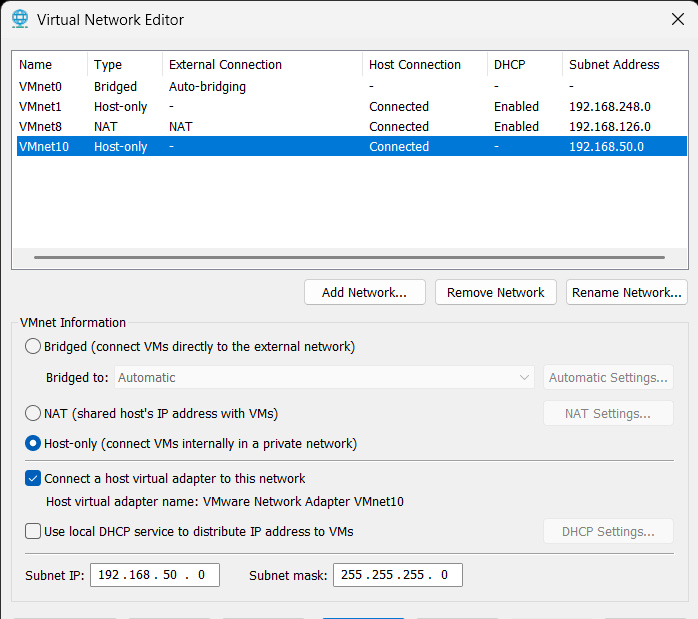
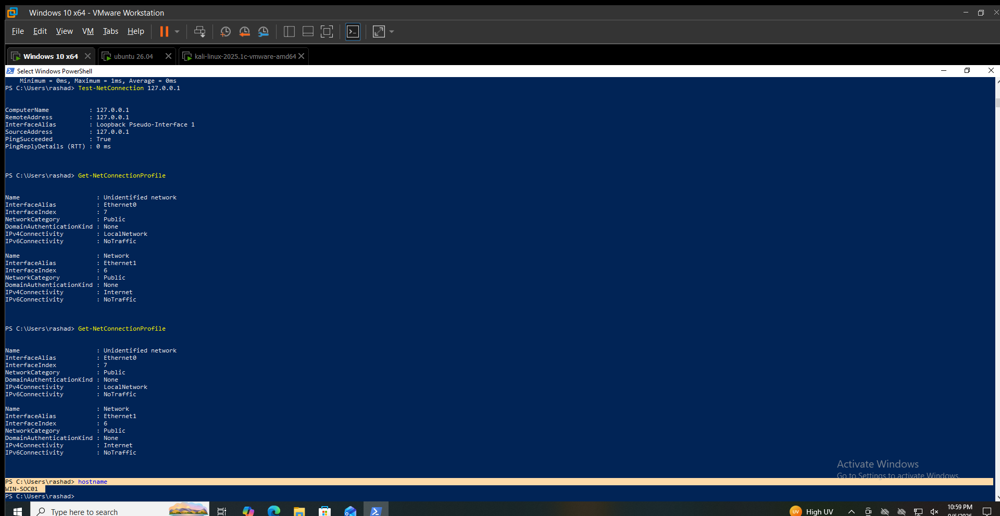
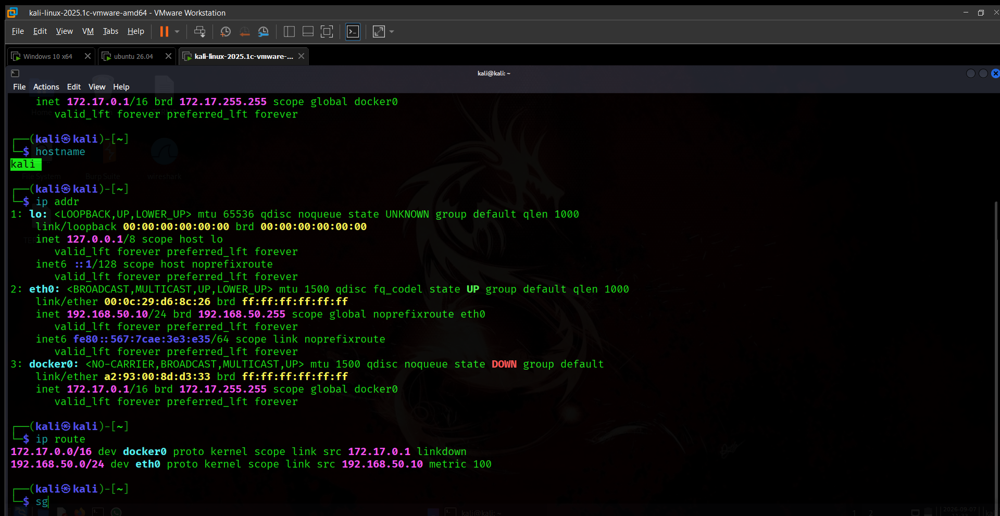
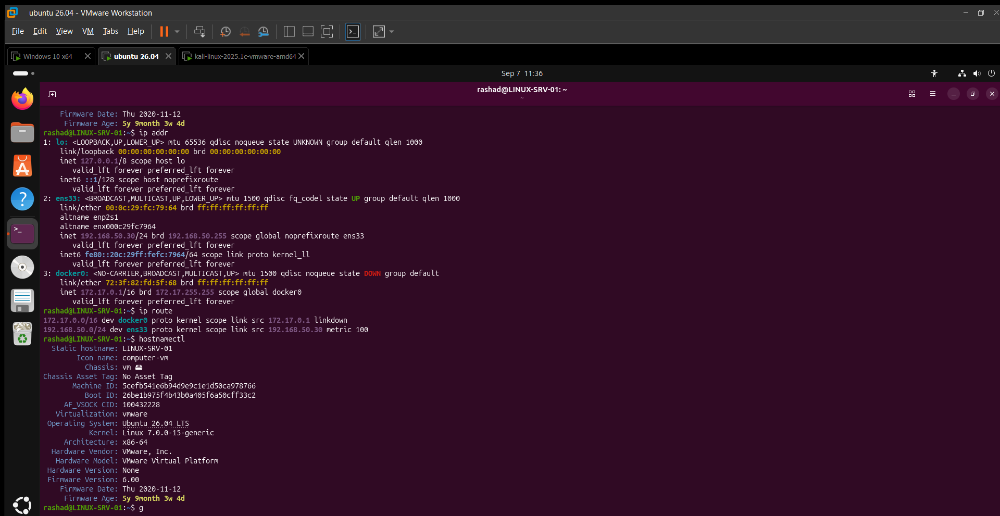
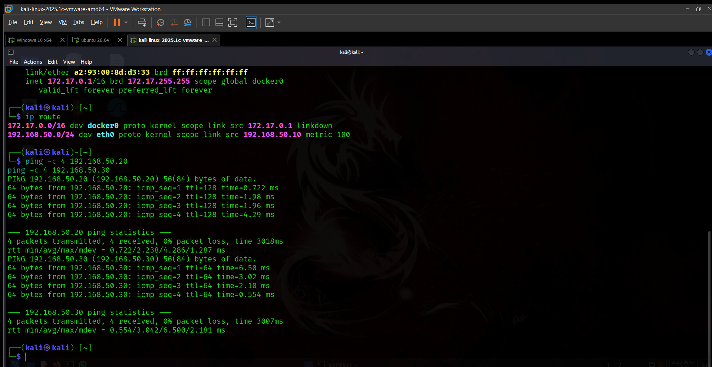
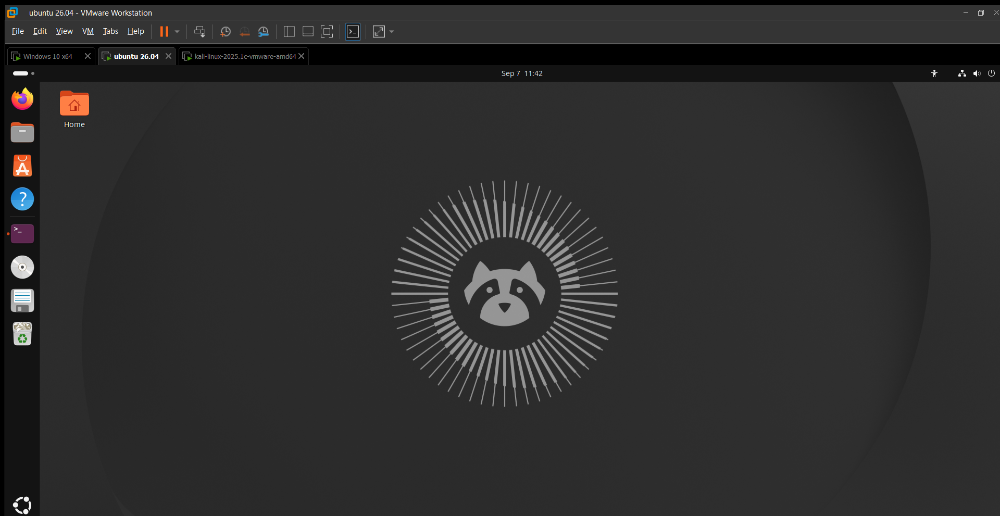

# Lab Setup

## Objective

Set up the Windows, Kali Linux, and Ubuntu systems used in the SOC lab.

## Lab Architecture

```text
                    SOC/Lab Network
                    192.168.50.0/24
                           │
          ┌────────────────┼────────────────┐
          │                │                │
      WIN-SOC01           Kali        LINUX-SRV-01
      192.168.50.20   192.168.50.10    192.168.50.30
```

## VMware Configuration

The systems are running as VMware virtual machines connected through VMnet10.

## Virtual Machines

### WIN-SOC01

```text
WIN-SOC01
│
├── Ethernet0
│   └── 192.168.50.20/24
│
└── Ethernet1
    └── 192.168.126.131/24
```

### Kali

```text
Kali
└── eth0
    └── 192.168.50.10/24
```

### Ubuntu

```text
LINUX-SRV-01
└── ens33
    └── 192.168.50.30/24
```

## Network Architecture

```text
VMnet10 - 192.168.50.0/24
│
├── Kali
│   └── 192.168.50.10
│
├── WIN-SOC01
│   └── 192.168.50.20
│
└── LINUX-SRV-01
    └── 192.168.50.30
```

## Network Configuration

| System       | Interface | IPv4               |
| ------------ | --------- | ------------------ |
| WIN-SOC01    | Ethernet0 | 192.168.50.20/24   |
| WIN-SOC01    | Ethernet1 | 192.168.126.131/24 |
| Kali         | eth0      | 192.168.50.10/24   |
| LINUX-SRV-01 | ens33     | 192.168.50.30/24   |

## Connectivity Validation

Network addresses and routes were checked using:

* Windows: `ipconfig`, `Get-NetIPConfiguration`
* Kali: `ip addr`, `ip route`
* Ubuntu: `ip addr`, `ip route`

## Security Isolation

The `192.168.50.0/24` network has no default gateway configured on the Kali, Ubuntu, and Windows lab interfaces shown above.

## Evidence

### VMware Network Configuration



### Windows Hostname



### Kali Linux VM



### Ubuntu Server VM



### Network Validation



### VMware Lab Overview

