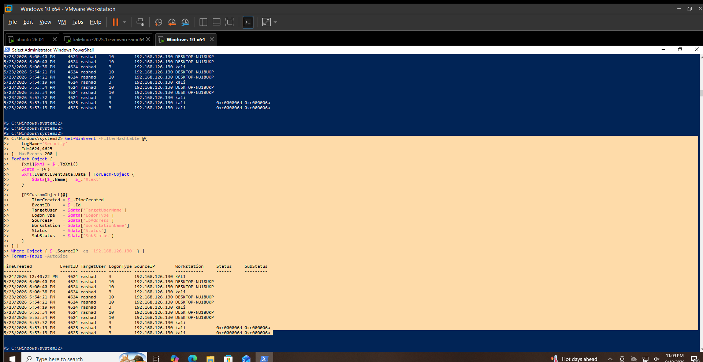

# Authentication Hunting

## Hunting Hypothesis

Repeated failed authentication attempts may indicate password guessing or other authentication-related activity.

## Data Source

Windows Security Event Log

## Event IDs

- `4625` — An account failed to log on
- `4624` — An account was successfully logged on

## Hunting Method

Authentication events were reviewed for:

- Repeated failed logons
- Target username
- Source IP address
- Logon type
- Workstation name
- Failure status
- Successful logons following failed attempts

## Activity Identified

Source IP `192.168.126.130` generated failed and successful authentication events involving the `rashad` account.

Two failed logons were observed:

- `5/23/2026 5:53:13 PM`
- `5/23/2026 5:53:19 PM`

Both events were:

- Event ID: `4625`
- Target user: `rashad`
- Logon Type: `3`
- Source IP: `192.168.126.130`
- Workstation: `kali`
- Status: `0xc000006d`
- SubStatus: `0xc000006a`

Successful logons from the same source followed shortly after:

- `5/23/2026 5:53:32 PM` — Event ID `4624`, Logon Type `3`, workstation `kali`
- `5/23/2026 5:53:34 PM` — Event ID `4624`, Logon Type `10`, workstation `DESKTOP-NU18UKP`

Additional successful authentication events from the same source were observed at `5:54:19 PM`, `5:54:21 PM`, `6:00:38 PM`, and `6:00:40 PM`.

## Contextual Analysis

The events show failed authentication attempts followed by successful authentication from the same source address.

The failed attempts occurred only seconds before the first observed successful logon.

The available telemetry does not establish whether the failed attempts were caused by malicious activity, incorrect credentials, or another authentication-related condition.

## Analyst Assessment

**Suspicious / Requires Context**

The sequence is relevant for further authentication investigation because failed logons were followed shortly by successful logons from the same source.

The activity is not classified as a confirmed attack based on the available evidence.

## MITRE ATT&CK Mapping

- **T1110 — Brute Force**

The activity is relevant to brute-force investigation, but the available evidence does not confirm a brute-force attack.

## Limitations

- The source system associated with `192.168.126.130` was not independently validated during this hunt.
- The events alone do not establish attacker intent.
- No malicious process or attack tool was attributed to this authentication sequence.

## Validation Status

**VALIDATED LOCALLY**

Windows Security Event IDs `4624` and `4625` were queried and correlated on `WIN-SOC01`.

## Evidence

