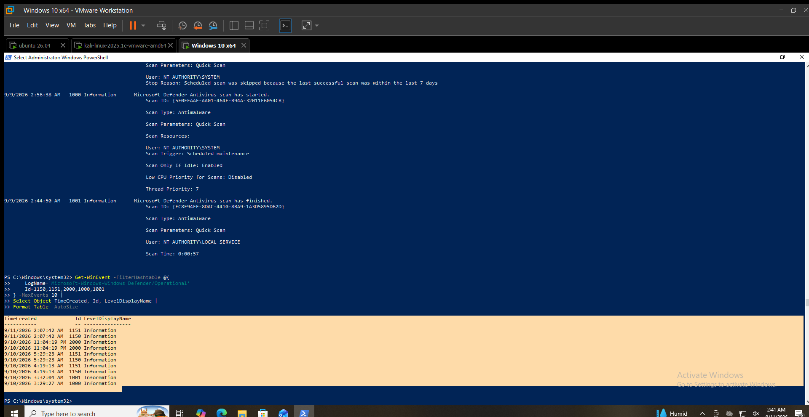

# Defender Hunting

## Hunting Hypothesis

Microsoft Defender telemetry should be reviewed for detected threats, endpoint health, security intelligence updates, and scan activity.

## Data Source

Microsoft Defender Antivirus

## Hunting Method

The following were reviewed:

* Defender threat detections
* Defender threat records
* Defender Operational event log
* Endpoint health events
* Security intelligence updates
* Antivirus scan activity

## Activity Identified

`Get-MpThreatDetection` returned no output.

`Get-MpThreat` also returned no output.

Defender Operational events showed:

* Event ID `1150` — Endpoint Protection client reported a healthy state
* Event ID `1151` — Endpoint Protection client health report
* Event ID `2000` — Security intelligence update
* Event ID `1000` — Quick Scan started
* Event ID `1001` — Quick Scan completed

The latest health report showed real-time protection, on-access protection, IOAV protection, and behavior monitoring enabled.

## Contextual Analysis

No Defender threat records were returned by the threat queries.

The Operational log showed normal Defender health reporting, security intelligence updates, and Quick Scan activity.

Configuration-change events were also present in the Defender Operational log, but they were not treated as malicious based on the event alone.

## Analyst Assessment

**No Threat Records Observed**

No Defender threat records were observed during the Day 5 hunting activity.

The available telemetry does not establish that the system is malware-free.

## MITRE ATT&CK Mapping

No specific ATT&CK technique was assigned because no malicious Defender detection was identified during this hunt.

## Limitations

* No Defender threat records were returned during the hunt.
* No malicious file or activity was identified through Defender telemetry.
* Defender events alone do not establish the absence of threats.

## Validation Status

**VALIDATED LOCALLY**

Defender threat queries and the Microsoft Defender Operational event log were successfully reviewed on `WIN-SOC01`.

## Evidence

