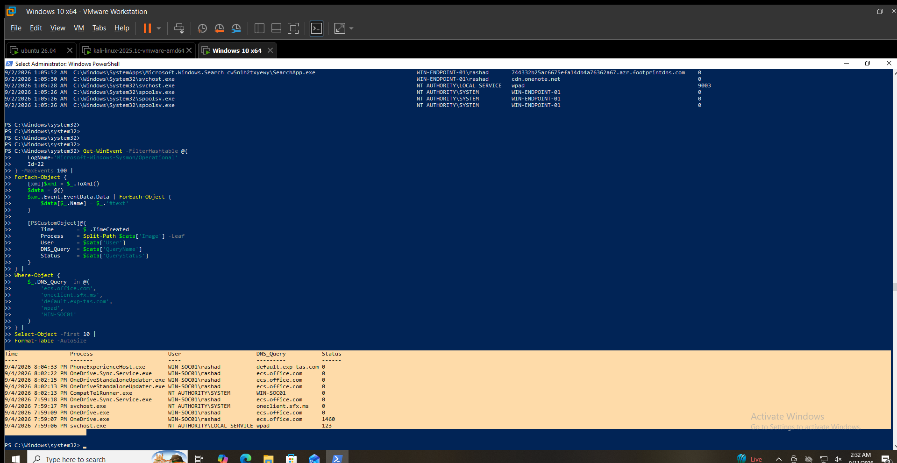

# DNS Hunting

## Hunting Hypothesis

DNS query activity should be reviewed for unusual domains, repeated queries, query status, and the processes generating the requests.

## Data Source

Sysmon Operational Event Log

## Event ID

`22` — DNS query

## Hunting Method

DNS query events were reviewed for:

* Query name
* Query status
* Initiating process
* User
* Repeated queries
* Local and external DNS names

## Activity Identified

Multiple DNS queries were observed from Windows processes, including:

| Time                | Process                   | Query Name            | Query Status |
| ------------------- | ------------------------- | --------------------- | ------------ |
| 9/4/2026 8:04:33 PM | `PhoneExperienceHost.exe` | `default.exp-tas.com` | `0`          |
| 9/4/2026 8:02:22 PM | `OneDrive Sync Service`   | `ecs.office.com`      | `0`          |
| 9/4/2026 7:59:17 PM | `svchost.exe`             | `oneclient.sfx.ms`    | `0`          |
| 9/4/2026 7:59:06 PM | `svchost.exe`             | `wpad`                | `123`        |
| 9/4/2026 7:59:03 PM | `spoolsv.exe`             | `WIN-SOC01`           | `0`          |

Additional DNS queries from Windows Search, OneDrive, Microsoft services, and other system processes were also observed.

## Contextual Analysis

The observed DNS activity included both local/system names and external service domains.

Several queries were associated with normal Windows and Microsoft-related processes such as OneDrive and `svchost.exe`.

Different query status values were observed in the telemetry. A DNS query status alone was not treated as evidence of malicious activity.

The available telemetry does not establish malicious intent for the observed DNS activity.

## Analyst Assessment

**Observed — Requires Context**

DNS activity was successfully identified and reviewed through Sysmon Event ID `22`.

No malicious DNS behavior was established from the observed events alone.

## MITRE ATT&CK Mapping

* **T1071.004 — DNS**

DNS telemetry can support investigation of command-and-control and other network activity, but the observed events alone do not establish malicious use of DNS.

## Limitations

* DNS query events alone do not establish malicious intent.
* Domain reputation was not independently validated during this hunt.
* Some query status values require additional DNS-level investigation to determine their exact cause.
* The observed activity represents historical telemetry from the lab endpoint.

## Validation Status

**VALIDATED LOCALLY**

Sysmon Event ID `22` was successfully queried and reviewed for DNS activity on `WIN-SOC01`.

## Evidence

