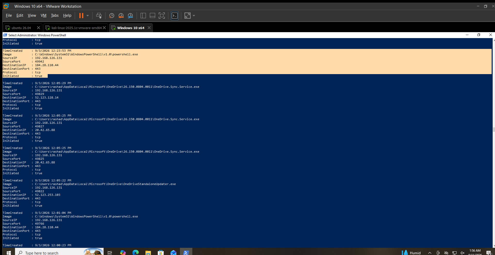

# Network Hunting

## Hunting Hypothesis

Network connection activity should be reviewed for unexpected destinations, ports, processes, and repeated connections between systems.

## Data Source

Sysmon Operational Event Log

## Event ID

`3` — Network connection

## Hunting Method

Network connection events were reviewed for:

* Source IP address
* Destination IP address
* Destination port
* Protocol
* Initiating process
* User
* Repeated connections

## Activity Identified

Four TCP connections from the Windows endpoint to the Ubuntu system were identified:

| Time                | Process          | Source          | Destination     | Port |
| ------------------- | ---------------- | --------------- | --------------- | ---- |
| 9/2/2026 3:56:30 AM | `powershell.exe` | `192.168.50.20` | `192.168.50.30` | `80` |
| 9/2/2026 3:56:57 AM | `powershell.exe` | `192.168.50.20` | `192.168.50.30` | `22` |
| 9/2/2026 3:58:17 AM | `powershell.exe` | `192.168.50.20` | `192.168.50.30` | `80` |
| 9/2/2026 3:58:37 AM | `powershell.exe` | `192.168.50.20` | `192.168.50.30` | `80` |

All four connections were:

* Protocol: `TCP`
* Initiated: `true`
* Process: `C:\Windows\System32\WindowsPowerShell\v1.0\powershell.exe`
* User: `WIN-ENDPOINT-01\rashad`

## Contextual Analysis

The connections were directed to `192.168.50.30`, the Ubuntu system in the SOC lab network.

The observed traffic included connections to TCP ports `80` and `22`.

PowerShell initiated the connections, making the activity relevant for further investigation when correlated with process and command-line telemetry.

The available evidence does not establish malicious intent.

## Analyst Assessment

**Observed — Requires Context**

The connections are relevant network activity within the lab environment.

No malicious network behavior was established from the observed Sysmon events alone.

## MITRE ATT&CK Mapping

* **T1049 — System Network Connections Discovery**

The network telemetry can support investigation of network connection activity, but the observed events alone do not establish that this technique was used maliciously.

## Limitations

* The connection events do not contain the PowerShell command that initiated each connection.
* The events alone do not establish malicious intent.
* Historical telemetry contains the hostname `WIN-ENDPOINT-01`, which was preserved exactly as recorded.

## Validation Status

**VALIDATED LOCALLY**

Sysmon Event ID `3` was successfully queried and reviewed for network connection activity.

## Evidence

