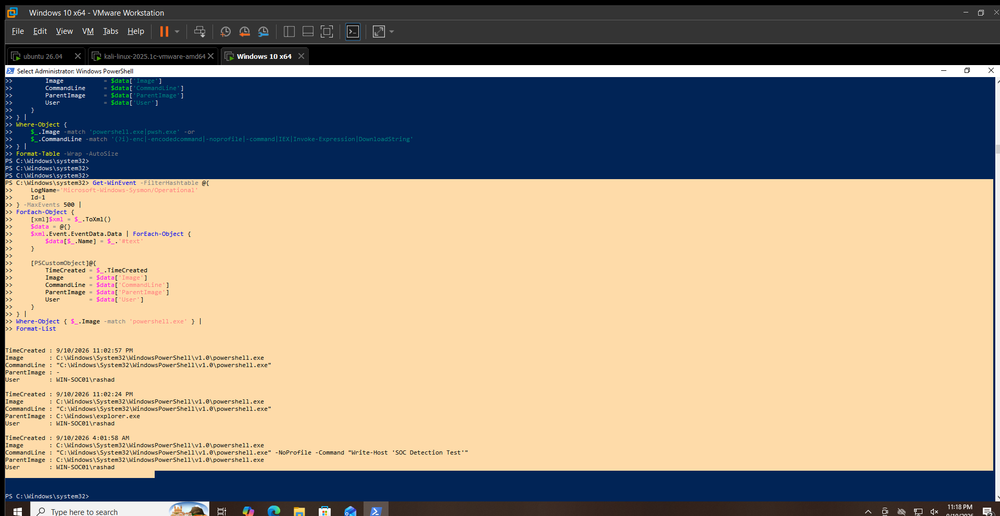

# PowerShell Hunting

## Hunting Hypothesis

PowerShell process activity should be reviewed for command-line indicators that may require further investigation.

## Data Source

Sysmon Operational Event Log

## Event ID

`1` — Process creation

## Hunting Method

PowerShell process creation events were reviewed for:

- PowerShell executable
- Command line
- Parent process
- User
- Command-line indicators such as `-enc`, `-encodedcommand`, `-noprofile`, `-command`, `IEX`, `Invoke-Expression`, and `DownloadString`

## Activity Identified

A PowerShell process created during a controlled detection test was identified at:

`9/10/2026 4:01:58 AM`

Observed details:

- Image: `C:\Windows\System32\WindowsPowerShell\v1.0\powershell.exe`
- Command Line: `"C:\Windows\System32\WindowsPowerShell\v1.0\powershell.exe" -NoProfile -Command "Write-Host 'SOC Detection Test'"`
- Parent Image: `C:\Windows\System32\WindowsPowerShell\v1.0\powershell.exe`
- User: `WIN-SOC01\rashad`

## Contextual Analysis

The command line contains `-NoProfile` and `-Command`, which are useful indicators when hunting PowerShell activity.

However, the command executed `Write-Host 'SOC Detection Test'`, confirming that this event was generated as a controlled benign test.

The presence of a PowerShell indicator alone does not establish malicious activity.

## Analyst Assessment

**Benign — Controlled Test**

The observed PowerShell execution was generated intentionally to validate process telemetry and detection logic.

No malicious PowerShell behavior was established from this event.

## MITRE ATT&CK Mapping

- **T1059.001 — PowerShell**

The event is relevant to PowerShell activity hunting.

## Limitations

- The observed event was a controlled test.
- Command-line indicators alone do not establish malicious intent.
- No malicious PowerShell payload was identified.

## Validation Status

**VALIDATED LOCALLY**

Sysmon Event ID `1` was successfully queried and reviewed for PowerShell process activity on `WIN-SOC01`.

## Evidence

