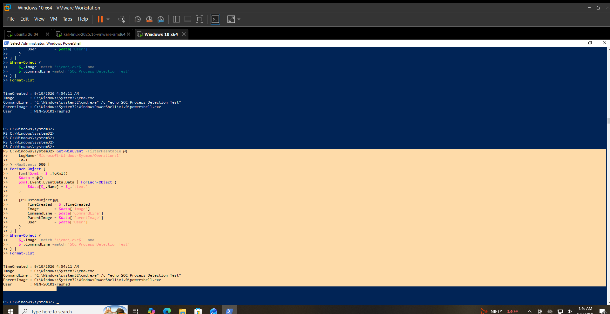

# Process Hunting

## Hunting Hypothesis

Process creation activity should be reviewed for unusual processes, command lines, parent-child relationships, users, and execution paths.

## Data Source

Sysmon Operational Event Log

## Event ID

`1` — Process creation

## Hunting Method

Process creation events were reviewed for:

* Process name
* Command line
* Parent process
* User
* Execution path
* Potentially interesting process types such as `cmd.exe` and `powershell.exe`

Processes were not classified as malicious based on process name alone.

## Activity Identified

A `cmd.exe` process was identified during a controlled process detection test at:

`9/10/2026 4:54:11 AM`

Observed details:

* Image: `C:\Windows\System32\cmd.exe`
* Command Line: `"C:\Windows\system32\cmd.exe" /c "echo SOC Process Detection Test"`
* Parent Image: `C:\Windows\System32\WindowsPowerShell\v1.0\powershell.exe`
* User: `WIN-SOC01\rashad`

## Contextual Analysis

The process was launched from PowerShell and executed a simple `echo` command.

The command was intentionally generated as a controlled test to validate Sysmon process creation telemetry and the local detection logic.

A second `cmd.exe` event was also observed from VMware Tools running as `NT AUTHORITY\SYSTEM`. This was treated as normal system activity and was not used as suspicious evidence.

## Analyst Assessment

**Benign — Controlled Test**

The observed `cmd.exe` execution was intentionally generated to validate process telemetry.

No malicious process behavior was established from this event.

## MITRE ATT&CK Mapping

* **T1059.003 — Windows Command Shell**

The event is relevant to Windows command shell activity hunting.

## Limitations

* The observed process was a controlled test.
* Process names alone do not establish malicious intent.
* No malicious command or payload was identified.

## Validation Status

**VALIDATED LOCALLY**

Sysmon Event ID `1` was successfully queried and reviewed for process creation activity on `WIN-SOC01`.

## Evidence

