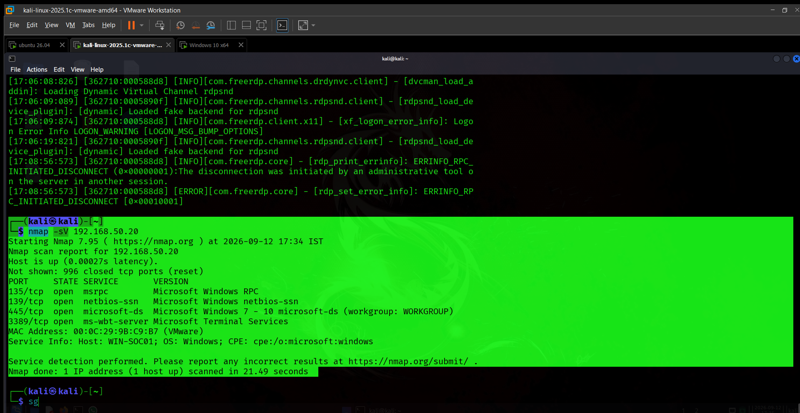
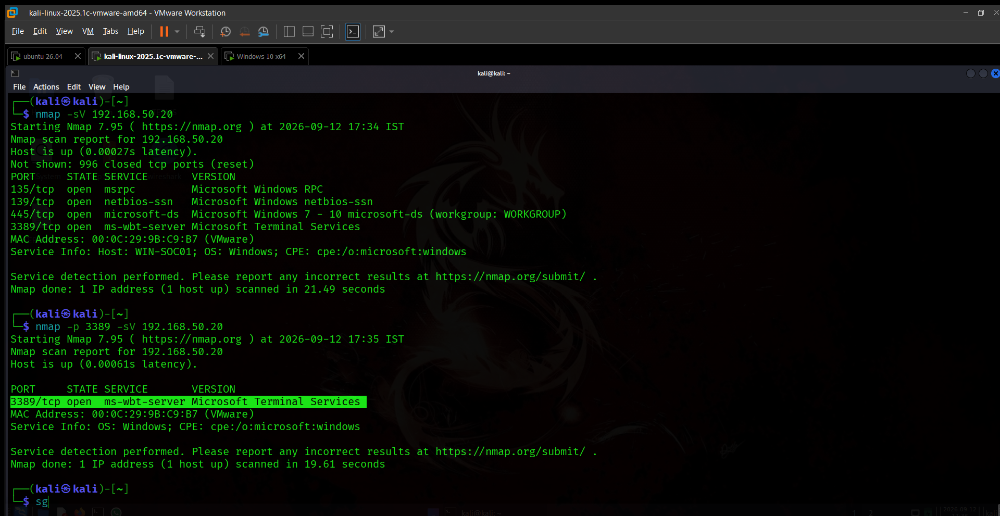
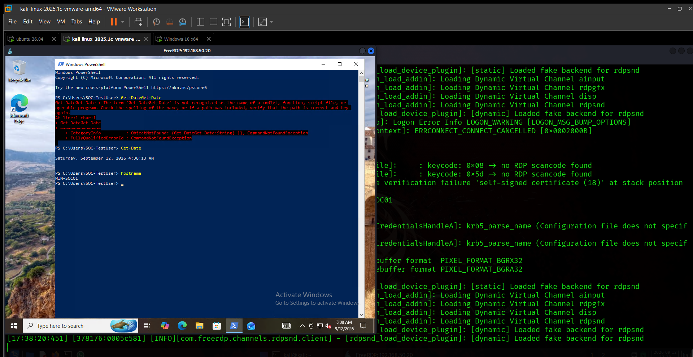
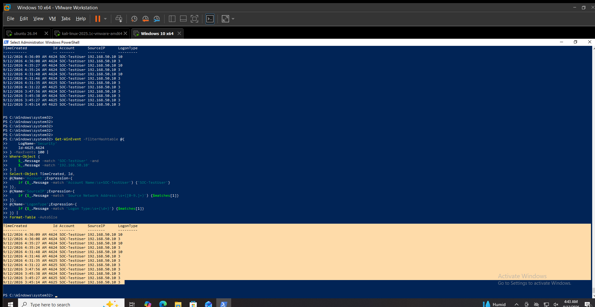
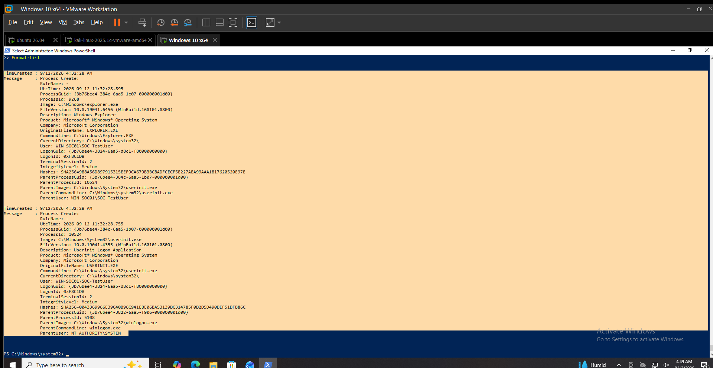
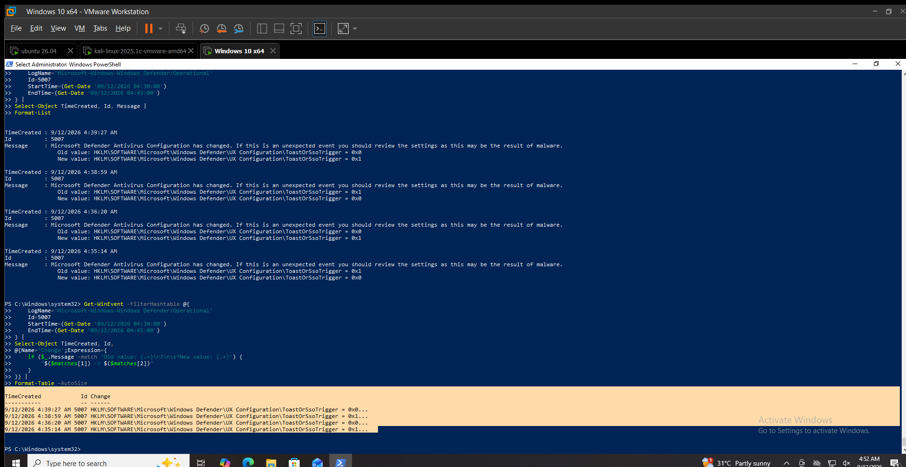
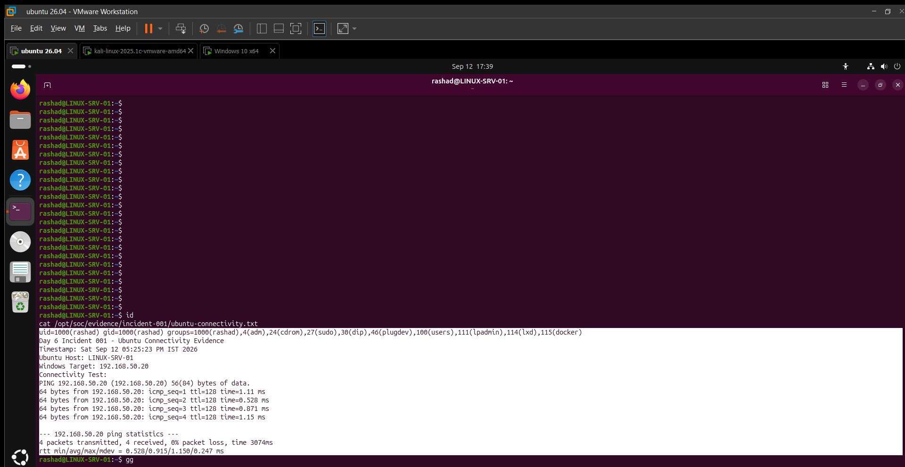
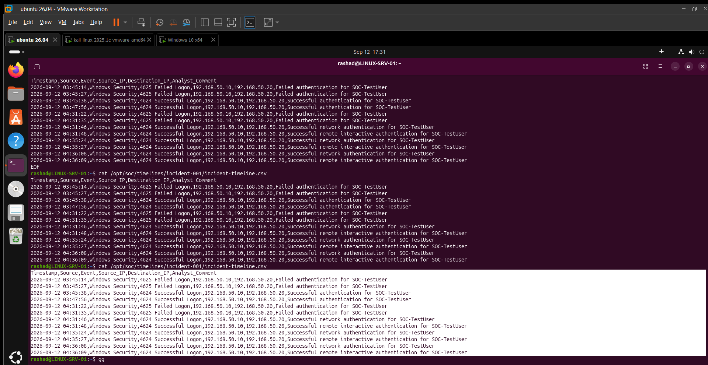

# Incident 001 — Controlled Adversary Simulation & Investigation

## Incident Classification

Controlled security exercise conducted inside the isolated VMware SOC lab.

## Executive Summary

A controlled adversary simulation was performed from Kali (`192.168.50.10`) against `WIN-SOC01` (`192.168.50.20`).

Network reconnaissance identified TCP ports 135, 139, 445 and 3389 as open. Remote Desktop Services was confirmed to be running and listening on TCP 3389.

An existing lab account, `SOC-TestUser`, was prepared for the exercise and used for controlled authentication testing. Windows Security recorded failed and successful authentication events originating from Kali, including successful Remote Interactive Logon (Type 10).

Sysmon recorded normal Windows session initialization and background process activity for the test account. No fresh Sysmon Event ID 3 network connection involving Kali was observed during the investigation window.

Microsoft Defender reported no threat records. Defender protection remained enabled during the final validation.

The test account was removed from Remote Desktop Users and deleted after evidence collection.

## Systems Involved

| System       | Role                      | IP Address      |
| ------------ | ------------------------- | --------------- |
| Kali         | Adversary simulation      | `192.168.50.10` |
| WIN-SOC01    | Windows target            | `192.168.50.20` |
| LINUX-SRV-01 | SOC investigation/support | `192.168.50.30` |

## Attack Path

```text
Kali
192.168.50.10
     │
     ▼
Network Reconnaissance
     │
     ▼
Service Enumeration
     │
     ▼
Controlled RDP Authentication
     │
     ▼
WIN-SOC01
192.168.50.20
     │
     ├── Windows Security
     ├── Sysmon
     └── Microsoft Defender
             │
             ▼
      SOC Investigation
      LINUX-SRV-01
```

## Reconnaissance

Nmap service detection against `192.168.50.20` identified:



* TCP 135 — MSRPC
* TCP 139 — NetBIOS Session Service
* TCP 445 — Microsoft-DS/SMB
* TCP 3389 — Microsoft Terminal Services
* 996 TCP ports were reported closed



TCP 3389 was separately confirmed reachable from Kali.

## RDP Service Validation

On `WIN-SOC01`:

* `TermService` — Running
* Start Type — Manual
* TCP `3389` — Listening
* Process — `svchost.exe`
* Process ID — `1012`



Remote Desktop authentication from Kali was successfully observed in Windows Security.

## Authentication Activity



Windows Security recorded four controlled failed authentication events for `SOC-TestUser` originating from `192.168.50.10`.

The failures were:

* Event ID 4625
* Logon Type 3
* Source IP `192.168.50.10`
* Failure status `0xC000006D`
* Substatus `0xC000006A`
* Failure reason: unknown username or bad password

Successful authentication events were also observed, including Type 10 Remote Interactive Logon from Kali.

The activity was part of the controlled test. It is **not classified as a confirmed brute-force attack**.

## Sysmon Investigation



Sysmon Event ID 1 records associated with `SOC-TestUser` were reviewed.

The observed process chain included:

```text
winlogon.exe
    │
    ▼
userinit.exe
    │
    ▼
explorer.exe
```

Additional background processes such as `RuntimeBroker.exe` and `backgroundTaskHost.exe` were observed under the test user's session.

These processes were consistent with normal Windows session and background activity.

No Sysmon Event ID 3 involving Kali (`192.168.50.10`) was observed during the final three-hour investigation window.

## Microsoft Defender Investigation

`Get-MpThreatDetection` and `Get-MpThreat` returned no threat records.



Defender operational logging contained Event ID 5007 configuration-change events involving:

```text
HKLM\SOFTWARE\Microsoft\Windows Defender\UX Configuration\ToastOrSsoTrigger
```

These events were reviewed but did not provide evidence that real-time protection was disabled.

Final Defender status:

| Protection           | Status  |
| -------------------- | ------- |
| Antivirus            | Enabled |
| Real-Time Protection | Enabled |
| Behavior Monitoring  | Enabled |
| IOAV Protection      | Enabled |
| Network Inspection   | Enabled |
| Tamper Protection    | Enabled |
| AM Running Mode      | Normal  |

## Ubuntu Investigation

`LINUX-SRV-01` was used as the investigation/support system.



Connectivity to `WIN-SOC01` was verified successfully:

Supporting evidence:

[ubuntu-connectivity.txt](../documentation/ubuntu-evidence/ubuntu-connectivity.txt)

[ubuntu-network.txt](../documentation/ubuntu-evidence/ubuntu-network.txt)

## Incident Timeline



The investigation timeline was recorded in:

```text
incidents/incident-timeline.csv
```

The timeline correlates Windows Security authentication events from Kali with the controlled test activity.

## Evidence

```text
Microsoft-Enterprise-SOC/
├── incidents/
│   ├── incident-001.md
│   └── incident-timeline.csv
│
├── documentation/
│   └── ubuntu-evidence/
│       ├── ubuntu-connectivity.txt
│       └── ubuntu-network.txt
│
└── screenshots/
    ├── DAY06-01-kali-recon.png
    ├── DAY06-02-service-enumeration.png
    ├── DAY06-03-authentication-test.png
    ├── DAY06-04-windows-authentication.png
    ├── DAY06-05-sysmon-investigation.png
    ├── DAY06-06-defender-investigation.png
    ├── DAY06-07-ubuntu-evidence.png
    └── DAY06-08-incident-timeline.png
```    
    
## MITRE ATT&CK Mapping

| Technique                | ID        | Evidence                                          |
| ------------------------ | --------- | ------------------------------------------------- |
| Network Service Scanning | T1046     | Nmap reconnaissance                               |
| Remote Services: RDP     | T1021.001 | RDP service and controlled authentication         |
| Valid Accounts           | T1078     | Dedicated lab test account used during simulation |

`T1110 Brute Force` was not mapped because the exercise does not establish a confirmed brute-force attack.

## Detection Assessment

The exercise demonstrated that the local SOC telemetry could provide:

* Windows authentication telemetry
* Sysmon process telemetry
* Defender protection and operational telemetry
* Source IP and account information
* Timeline correlation between authentication activity and the test environment

No confirmed malware detection or system compromise was established.

## Containment and Cleanup

After evidence collection:

1. `SOC-TestUser` was removed from `Remote Desktop Users`.
2. `SOC-TestUser` was deleted from `WIN-SOC01`.
3. Verification confirmed that the account no longer existed.

## Analyst Conclusion

The controlled adversary simulation was completed successfully within the isolated VMware laboratory.

Reconnaissance, RDP exposure, controlled authentication activity and endpoint telemetry were observed and investigated. Windows Security provided the strongest authentication evidence, while Sysmon and Microsoft Defender supplied supporting endpoint telemetry.

No Defender threat record or confirmed malicious compromise was identified during the exercise.
